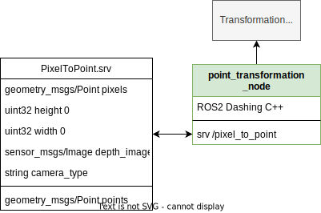

# Point Transformation

ROS2 Node for 2D / 3D Point Transformation

## Interface:

### Point Transformation Node

- `point_transformation_node` (ROS2 Dashing in C++)



#### Services

- `point_transformation_node/pixel_to_point` (Custom type)

    ```bash
    geometry_msgs/Point[] pixels        # pixels in rgb image
    uint32 height 0                     # rgb image height, default if unassigned = 0
    uint32 width 0                      # rgb image width, default if unassigned = 0
    sensor_msgs/Image depth_image       # corresponding depth image
    string camera_type                  # used camera for depth image ("roboception" or "realsense")
    ---
    geometry_msgs/Point[] points        # xyz of points in [m]
    ```

#### Parameter

Change in `ros/config/params.yaml`

```yaml
opening_angle_horizontal: 61.0  # Horizontal opening angle of the used Camera (Roboception) in degrees
opening_angle_vertical: 48.0    # Vertical opening angle in degrees
focal_factor: 0.75              # Focal factor of the camera lense
width: 1920                     # Default width if no image width is given to the service
height: 1080                    # Default height
default_depth: 1.0              # Default depth in m if no depth image is given
max_pixel_range_for_depth_matching: 5 # Search in a NxN area around the correct pixel if it is nan
```

## How to run:
    ros2 launch point_transformation point_transformation.launch.py

### Launch files

- `point_transformation.launch.py`

    Launch node and load configured parameters


## Testing:

    ros2 run point_transformation client.py

## Todo:

- [x] update .svg with correct interface
